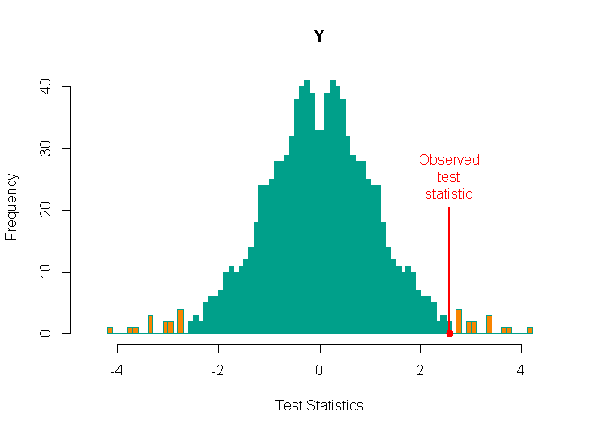

<!-- README.md is generated from README.Rmd. Please edit that file -->
Welcome to the dev-version of the
=================================

[library flip on CRAN](http://cran.r-project.org/web/packages/flip/index.html)
==============================================================================

------------------------------------------------------------------------

Set up
------

To **install** this github version type (in R):

    #if devtools is not installed yet: 
    # install.packages("devtools") 
    library(devtools)
    install_github("livioivil/flip")

------------------------------------------------------------------------

Some examples
-------------

``` r
library(flip)
```

*A univariate analysis*

Testing the symmetry around 0 in a one sample (i.e. equivalent to one sample t-test)

``` r
set.seed(1)
y=rnorm(10)+.5
res=flip(y)
#> Warning in rep(c(rep(0, (2^p/2^n)), rep(1, (2^p/2^n))), length = 2^p):
#> partial argument match of 'length' to 'length.out'

#> Warning in rep(c(rep(0, (2^p/2^n)), rep(1, (2^p/2^n))), length = 2^p):
#> partial argument match of 'length' to 'length.out'

#> Warning in rep(c(rep(0, (2^p/2^n)), rep(1, (2^p/2^n))), length = 2^p):
#> partial argument match of 'length' to 'length.out'

#> Warning in rep(c(rep(0, (2^p/2^n)), rep(1, (2^p/2^n))), length = 2^p):
#> partial argument match of 'length' to 'length.out'

#> Warning in rep(c(rep(0, (2^p/2^n)), rep(1, (2^p/2^n))), length = 2^p):
#> partial argument match of 'length' to 'length.out'

#> Warning in rep(c(rep(0, (2^p/2^n)), rep(1, (2^p/2^n))), length = 2^p):
#> partial argument match of 'length' to 'length.out'

#> Warning in rep(c(rep(0, (2^p/2^n)), rep(1, (2^p/2^n))), length = 2^p):
#> partial argument match of 'length' to 'length.out'

#> Warning in rep(c(rep(0, (2^p/2^n)), rep(1, (2^p/2^n))), length = 2^p):
#> partial argument match of 'length' to 'length.out'

#> Warning in rep(c(rep(0, (2^p/2^n)), rep(1, (2^p/2^n))), length = 2^p):
#> partial argument match of 'length' to 'length.out'
summary(res)
#>  Call:
#>  flip(Y = y) 
#> 1023 permutations.
#>   Test  Stat tail p-value sig.
#> Y    t 2.561   ><  0.0293    *
```

and ploting

``` r
plot(res) # same ad hist(res)
```



*A multivarite analysis*

``` r
set.seed(1)
df=data.frame(y1=rnorm(10)+.5,y2=rnorm(10))
res=flip(~.,data=df)
#> Warning in rep(c(rep(0, (2^p/2^n)), rep(1, (2^p/2^n))), length = 2^p):
#> partial argument match of 'length' to 'length.out'

#> Warning in rep(c(rep(0, (2^p/2^n)), rep(1, (2^p/2^n))), length = 2^p):
#> partial argument match of 'length' to 'length.out'

#> Warning in rep(c(rep(0, (2^p/2^n)), rep(1, (2^p/2^n))), length = 2^p):
#> partial argument match of 'length' to 'length.out'

#> Warning in rep(c(rep(0, (2^p/2^n)), rep(1, (2^p/2^n))), length = 2^p):
#> partial argument match of 'length' to 'length.out'

#> Warning in rep(c(rep(0, (2^p/2^n)), rep(1, (2^p/2^n))), length = 2^p):
#> partial argument match of 'length' to 'length.out'

#> Warning in rep(c(rep(0, (2^p/2^n)), rep(1, (2^p/2^n))), length = 2^p):
#> partial argument match of 'length' to 'length.out'

#> Warning in rep(c(rep(0, (2^p/2^n)), rep(1, (2^p/2^n))), length = 2^p):
#> partial argument match of 'length' to 'length.out'

#> Warning in rep(c(rep(0, (2^p/2^n)), rep(1, (2^p/2^n))), length = 2^p):
#> partial argument match of 'length' to 'length.out'

#> Warning in rep(c(rep(0, (2^p/2^n)), rep(1, (2^p/2^n))), length = 2^p):
#> partial argument match of 'length' to 'length.out'
#> Warning in rep(tail, len = ncol(permT)): partial argument match of 'len' to
#> 'length.out'

#> Warning in rep(tail, len = ncol(permT)): partial argument match of 'len' to
#> 'length.out'
summary(res)
#>  Call:
#>  flip(Y = ~., data = df) 
#> 1023 permutations.
#>    Test   Stat tail p-value sig.
#> y1    t 2.5612   ><  0.0293    *
#> y2    t 0.7358   ><  0.4844
plot(res) 
```


Which is different from ploting

``` r
##set the following if you get an error (mostly using Rstudio)
#par(mar=c(1,1,1,1))
hist(res)
```


------------------------------------------------------------------------

References
----------

For the general framework of univariate and multivariate permutation tests see:

*Pesarin, F. (2001) Multivariate Permutation Tests with Applications in Biostatistics. Wiley, New York.*

For analysis of mixed-models see:

*L. Finos and D. Basso (2014) Permutation Tests for Between-Unit Fixed Effectsin Multivariate Generalized Linear Mixed Models. Statistics and Computing. Volume 24, Issue 6, pp 941-952. DOI: 10.1007/s11222-013-9412-6*

*D. Basso, L. Finos (2011) Exact Multivariate Permutation Tests for Fixed Effects in Mixed-Models. Communications in Statistics - Theory and Methods. DOI 10.1080/03610926.2011.627103*

For Rotation tests see:

*Langsrud, O. (2005) Rotation tests, Statistics and Computing, 15, 1, 53-60*

*A. Solari, L. Finos, J.J. Goeman (2014) Rotation-based multiple testing in the multivariate linear model. Biometrics. Accepted*

The colors of the plots of library flip are mostly taken from `display.wes.palette(5, "Darjeeling")` of [library(wesanderson)](https://github.com/karthik/wesanderson).

Bug reports
-----------

If you encounter a bug, please file a [reprex](https://github.com/tidyverse/reprex) (minimal reproducible example) on [github](https://github.com/livioivil/flip/issues).
